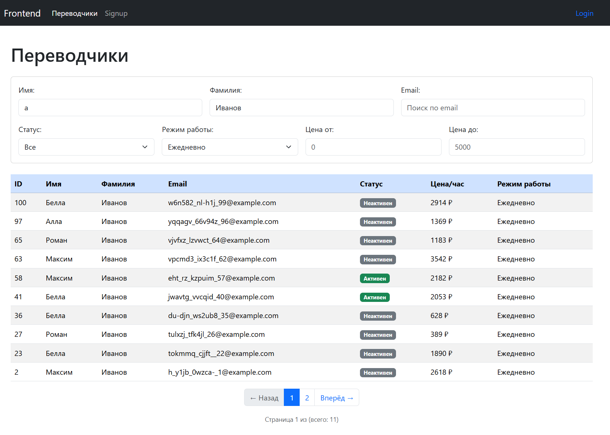
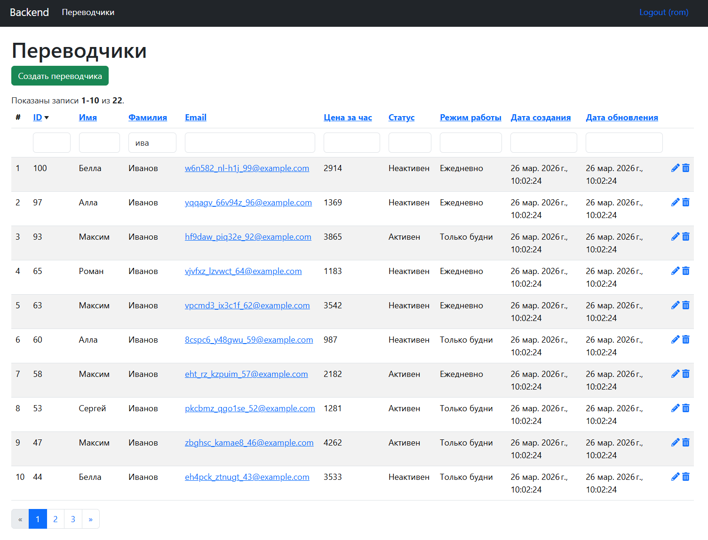

# Yii 2 Perevod

Приложение для управления переводчиками на базе Yii 2 Advanced Project Template.
Php + vue + mysql




## Описание

Проект включает в себя:
- **Frontend** — пользовательский интерфейс с фильтрацией переводчиков (Vue.js)
- **Backend** — админ-панель для CRUD операций (PHP)
- **Console** — консольные команды для управления данными

## Быстрый старт

### 1. Запуск Docker

```bash
docker-compose up -d --build
```

### 2. Установка зависимостей

```bash
docker-compose exec backend composer install
```

Если будет ругаться на уязвимости в пакетах phpunit/phpunit:

```bash
composer config audit.ignore PKSA-z3gr-8qht-p93v
```

### 3. Миграция базы данных

```bash
docker-compose exec backend php yii migrate
```

### 4. Создание тестового пользователя

```bash
# Параметры: username='rom', email='rom@rom.ru', password='123'
docker-compose exec backend php yii user-generate/create rom rom@rom.ru 123
```

### 5. Генерация тестовых данных (100 переводчиков)

```bash
docker-compose exec backend php yii translator-generate/create 100
```

## Доступ к приложениям

| Приложение | URL | Описание |
|------------|-----|----------|
| **Frontend** | http://localhost:20080/ | Список переводчиков с фильтрацией (Vue.js) |
| **Backend** | http://localhost:21080/ | Админ-панель с CRUD (PHP) |

## API

Внешнее API для работы с переводчиками:

| Метод | URL | Описание |
|-------|-----|----------|
| `GET` | `/api/external/translator/active` | Все активные переводчики |
| `GET` | `/api/external/translator/{id}` | Переводчик по ID |
| `GET` | `/api/external/translator/email/{email}` | Переводчик по email |
| `GET` | `/api/external/translator/list` | Список с фильтрами и пагинацией |

## Тесты

### Запуск unit-тестов

```bash
# Тесты сервиса генерации переводчиков
docker-compose exec backend php vendor/bin/codecept run common/tests/unit/services/TranslatorGeneratorServiceTest.php
```

### Запуск всех тестов

```bash
docker-compose exec backend php vendor/bin/codecept run
```

## Структура проекта

```
├── common/           # Общий код (модели, сервисы, репозитории)
│   ├── config/       # Общие конфигурации
│   ├── models/       # Модели данных
│   ├── repositories/ # Репозитории для работы с БД
│   ├── services/     # Бизнес-логика (сервисы)
│   └── tests/        # Unit-тесты
├── frontend/         # Frontend приложение
│   ├── controllers/  # Контроллеры
│   ├── views/        # Представления
│   └── web/js/       # JavaScript (Vue.js)
├── backend/          # Backend приложение (админка)
│   ├── controllers/  # Контроллеры
│   └── views/        # Представления
├── console/          # Console приложение
│   ├── controllers/  # Консольные команды
│   └── migrations/   # Миграции БД
└── environments/     # Конфигурации для сред (dev/prod)
```

## Технологии

- **Framework:** Yii 2.0+
- **PHP:** 8.1+
- **Database:** MySQL 8
- **Frontend:** Vue.js 3, Bootstrap 5
- **Testing:** Codeception, PHPUnit
- **Containerization:** Docker, Docker Compose

## Разработка

### Консольные команды

```bash
# Создать пользователя
docker-compose exec backend php yii user-generate/create <username> <email> <password>

# Сгенерировать переводчиков (указать количество)
docker-compose exec backend php yii translator-generate/create 100
```

### База данных (Docker)

| Параметр | Значение |
|----------|----------|
| Host | localhost:3306 |
| Database | yii2advanced |
| Username | yii2advanced |
| Password | secret |
| Root Password | verysecret |
